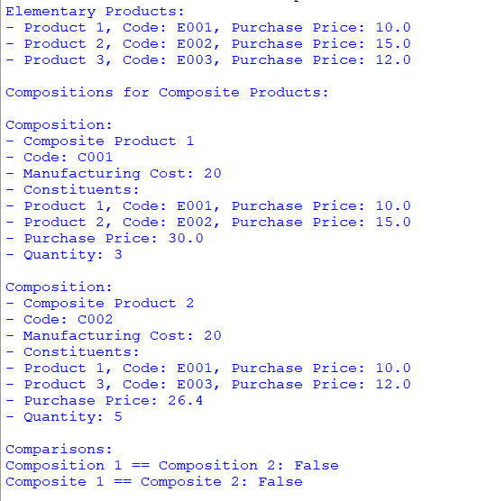

## Description
A Python program that handles elementary and composite product structures. This code allows users to create, organize, and manipulate both elementary and composite products. Additionally, it offers comprehensive pricing management, enabling dynamic pricing strategies for products of varying complexities.
## Example Usage

